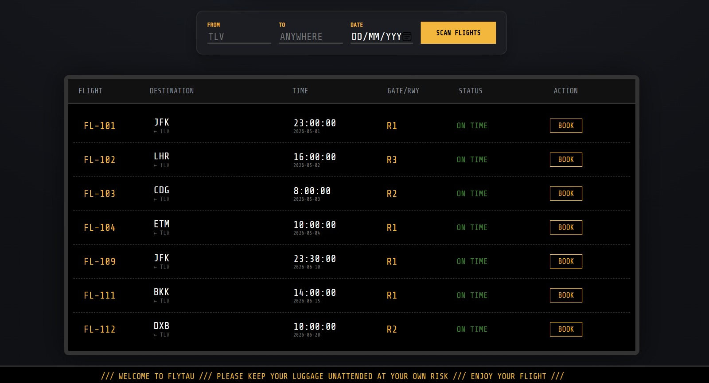
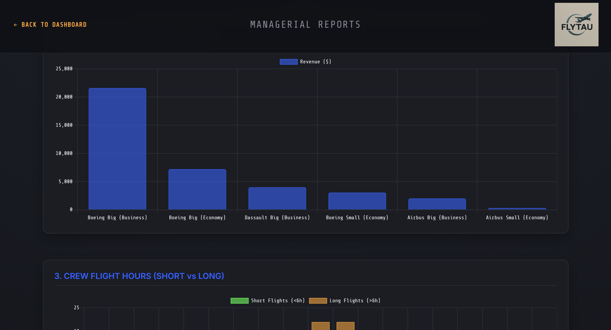
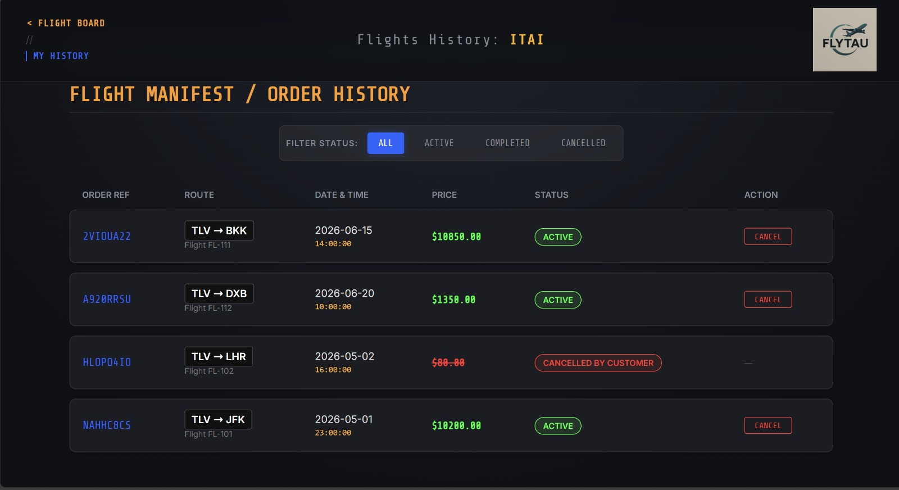

# ✈️ FLYTAU - Airline Management System

**FLYTAU** is a comprehensive, full-stack web application designed to manage an airline's operations. It facilitates the entire flight lifecycle: from scheduling routes and assigning crew resources (Pilots, Attendants, Aircraft) to handling customer bookings, cancellations, and generating managerial analytics.

The system features a distinct separation of concerns between **Guest Users**, **Registered Frequent Flyers**, and **Airline Managers**, all wrapped in a modern, responsive "Dark/Neon" UI.

---

## 🚀 Key Features

### 👨‍✈️ For Managers (Command Center)
* **Flight Scheduling Wizard:** A multi-step process to add flights, checking for resource conflicts (Plane/Runway availability) and race conditions in real-time.
* **Resource Management:** Assign specific planes, pilots, and attendants based on qualifications (e.g., Long-Haul training).
* **Dynamic Pricing:** Update Business/Economy ticket prices on the fly.
* **Analytics Dashboard:** Visual charts (via Chart.js) displaying revenue, occupancy rates, crew hours, and cancellation statistics.
* **Flight Operations:** Ability to abort/cancel flights (with logic enforcing 72-hour notice).

### 🧑‍💻 For Customers (Registered & Guests)
* **Flight Board:** Real-time departures board with status updates (On Time, Landed, Cancelled).
* **Visual Booking:** Interactive seat map selection (Business/Economy differentiation).
* **Guest Management:** Unregistered users can manage bookings via Order Reference & Email.
* **My Trips:** Order history, ticket wallet, and cancellation options (with automatic fee calculation).

---

## 🛠️ Tech Stack

* **Backend:** Python 3.x, Flask, Flask-Login.
* **Database:** MySQL (Relational Schema).
* **Frontend:** HTML5, CSS3 (Custom Neon Theme), Jinja2 Templates, JavaScript, Chart.js.
* **Database Connector:** `mysql-connector-python`.


---

## ⚙️ Installation & Setup

### 1. Clone the Repository
```bash
git clone [https://github.com/maorshavit-boop/InformationSystems.git](https://github.com/maorshavit-boop/InformationSystems.git)
cd InformationSystems
```

### 2. Install Dependencies from the requirements.ttx

### 3. Database Configuration
- Make sure you have MySQL Server installed and running.
- Open the file ```code/utils.py```.
- Update the db_config dictionary with your local MySQL credentials:
```bash
  db_config = {
    "host": "localhost",
    "user": "root",        # Your MySQL Username
    "password": "your_password", # Your MySQL Password
    "database": "FLYTAU",
    "autocommit": True
}
```
### 4. Initialize Database Schema
Run the provided SQL scripts in your MySQL Workbench or CLI in this exact order:
- ```SQL code/Create_Schema_FLYTAU.sql``` (Creates tables and relationships).
- ```SQL code/FLYTAU_Insert_Values.sql``` (Populates dummy data for testing).

### 5. Run the Application
``` bash
cd code
python main.py
```
The application will start at ```http://127.0.0.1:5000/```.

## 🔑 Login Credentials (for Testing)
The system comes pre-loaded with data. Use these accounts to test different flows:
| Role     | Email / ID        | Password | Access                                           |
|----------|-------------------|----------|--------------------------------------------------|
| Manager  | M-001             | pass1    | Reports, Pricing, Flight Creation, Cancellations |
| Customer | reg1@test.com     | pass1    | Booking, History, Seat Selection                 |
| Guest    | (No Login)        | N/A      | Can book flights & manage via Order Code         |

## 📂 Project Structure

FLYTAU/  
├── code/  
│   ├── main.py            # Application entry point & Routes  
│   ├── utils.py           # Database helpers & Business logic  
│   └── sql_queries.py     # Complex SQL queries for reports  
├── SQL code/  
│   ├── Create_Schema.sql  # DDL  
│   └── Insert_Values.sql  # DML (Mock Data)  
├── static/  
│   ├── style.css          # Global styling (Dark/Neon)  
│   └── logo.png           # Assets  
├── templates/  
│   ├── homepage.html      # Main Flight Board  
│   ├── booking.html       # Seat Map  
│   ├── reports.html       # Manager Analytics
│   ├── add_flight.html    # Manager Wizard
│   └── ... (other HTML templates)
└── requirements.txt       # Dependencies for the project
└── README.md              # This file

## 📸 Screenshots

|      Homepage - flight dashboard      |      Manager Dashboard - System Reports       |
|:-------------------------------------:|:---------------------------------------------:|
|      |  |
|           **Book a flight**           |                 **My trips**                  |
|  |  

## 📝 License
This project was created for the Information Systems course.
